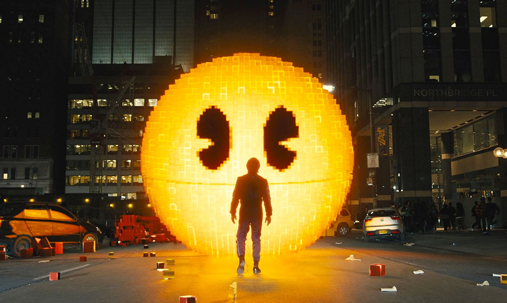

### jmei0847_9103_tut02
# **Week 8 Quiz**

## Part 1
### Imaging Technique Inspiration

In digital art, if some imaging technology that is different from other styles suddenly appears in the imaging, there will be a kind of visual collision.
I got some interesting inspiration from the movie *Pixels*. In the film, some pixel-style items become physical and appear in the real world. It brings a visual experience that combines games with reality.

I want to change the image style of some of the patterns in my project to pixel style, so that they contrast with other styles. I wanted to provide some sense of the clash of visual styles. If possible, these pixel style elements will be changing, not static.

#### **Poster of the movie *Pixels***

 [Reference of film poster](https://en.wikipedia.org/wiki/Pixels_(2015_film))

#### __Screenshot (image examples) from the movie *Pixels*:__
- Example 1

- Example 2

- Example 3

- Example 4

 [Reference of film screenshot Example 1-3](https://digitaldomain.com/work/%E5%83%8F%E7%B4%A0%E5%A4%A7%E6%88%98/?lang=zh-hans)

[Reference of film screenshot Example 4 from Pinterest](https://au.pinterest.com/pin/432275264238297904/)

## Part 2
### Coding Technique Exploration
To achieve this pixel-style graphics transformation effect, Youtuber __The Coding Train__ mentioned in an episode how to write cellular automata simulation code that can generate similar effects. It can change patterns automatically without clicking or selecting them, just like a cell automatically evolves. 

According to the provided code, the small pattern will automatically generate changes, and the interaction between the pattern and the pattern will generate a randomness. I can refer to this coding technique to dynamically change some of the visual elements of the background in real time, achieving a random aesthetic of visual style collisions.

  [Coding Challenge #85: The Game of Life](https://www.youtube.com/watch?v=FWSR_7kZuYg&ab_channel=TheCodingTrain)

#### __Screenshot of the coding technique__
- Screenshot 1

- Screenshot 2

 [Link to sample code](https://editor.p5js.org/codingtrain/sketches/UtSMCB1zv)
